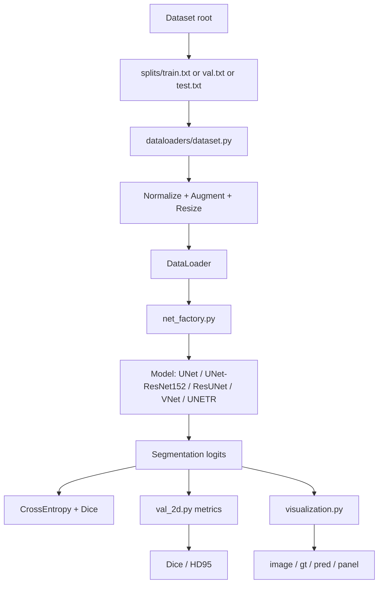
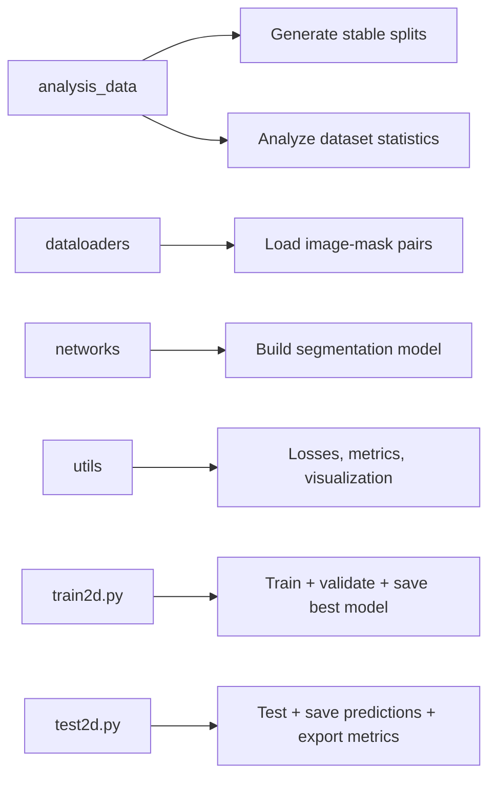

# 2D Segmentation Training Workspace

This project is organized as a clean 2D medical/polyp segmentation workspace.
The root pipeline is:

- `train2d.py`
- `test2d.py`
- `dataloaders/`
- `networks/`
- `utils/`
- `analysis_data/`

## Project Architecture

### Directory Architecture

```text
Code/
|-- train2d.py
|-- test2d.py
|-- README.md
|-- data/
|   |-- CVC-ClinicDB/
|   |   |-- PNG/
|   |   |-- TIF/
|   |   `-- splits/
|   |       |-- train.txt
|   |       |-- val.txt
|   |       `-- test.txt
|   `-- Kvasir-SEG/
|       |-- Kvasir-SEG/
|       |-- train.txt
|       |-- val.txt
|       `-- splits/
|           |-- train.txt
|           |-- val.txt
|           `-- test.txt
|-- dataloaders/
|   `-- dataset.py
|-- networks/
|   |-- common.py
|   |-- net_factory.py
|   |-- unet.py
|   |-- Unet_restnet.py
|   |-- residual_unet.py
|   |-- VNet.py
|   `-- unetr.py
|-- utils/
|   |-- losses.py
|   |-- val_2d.py
|   `-- visualization.py
|-- analysis_data/
|   |-- README.md
|   |-- generate_splits.py
|   |-- analyze_datasets.py
|   `-- reports/
`-- logs/
    `-- model/
        `-- supervised/
            `-- <exp>/
```

### Training and Evaluation Flow



### Component Roles



## Models

Available models in `net_factory.py`:

- `unet`
- `unet_resnet152`
- `resunet`
- `vnet`
- `unetr`

Supported aliases:

- `unet_restnet`
- `unet_restnet152`
- `resnet_unet`

## Datasets

### CVC-ClinicDB

- Total image/mask pairs: `612`
- Stable split files are stored in `data/CVC-ClinicDB/splits/`
- Current split:
  - `train`: `429`
  - `val`: `61`
  - `test`: `122`
- Default ratio: `70/10/20`

### Kvasir-SEG

- Total image/mask pairs: `1000`
- Original files:
  - `train.txt`: `880`
  - `val.txt`: `120`
- Stable split files are stored in `data/Kvasir-SEG/splits/`
- Current generated split:
  - `train`: `792`
  - `val`: `88`
  - `test`: `120`
- Policy:
  - original `val.txt` is treated as fixed `test`
  - new `val` is sampled from original `train.txt`

## Generate Stable Splits

```bash
python analysis_data/generate_splits.py --dataset all --seed 1337
```

This generates:

- `data/CVC-ClinicDB/splits/train.txt`
- `data/CVC-ClinicDB/splits/val.txt`
- `data/CVC-ClinicDB/splits/test.txt`
- `data/Kvasir-SEG/splits/train.txt`
- `data/Kvasir-SEG/splits/val.txt`
- `data/Kvasir-SEG/splits/test.txt`

## Analyze Data

```bash
python analysis_data/analyze_datasets.py --dataset all
```

Generated reports:

- `analysis_data/reports/cvc_clinicdb_summary.json`
- `analysis_data/reports/cvc_clinicdb_summary.md`
- `analysis_data/reports/kvasir_seg_summary.json`
- `analysis_data/reports/kvasir_seg_summary.md`
- `analysis_data/reports/dataset_overview.json`
- `analysis_data/reports/current_dataset_status.md`

The analysis includes:

- number of image/mask pairs
- split counts
- common image sizes
- RGB mean/std
- foreground ratio
- RGB pixel histogram
- mask value presence
- example sample file paths

## Train

Train Kvasir with the stable split:

```bash
python train2d.py --dataset kvasir --root_path data/Kvasir-SEG --model unet --train_split train --val_split val
```

Train CVC with ResNet152 encoder and separate validation split:

```bash
python train2d.py --dataset cvc --root_path data/CVC-ClinicDB --model unet_resnet152 --train_split train --val_split val
```

Train CVC and evaluate against test during training:

```bash
python train2d.py --dataset cvc --root_path data/CVC-ClinicDB --model unet_resnet152 --train_split train --val_split test
```

## Test

```bash
python test2d.py --dataset kvasir --root_path data/Kvasir-SEG --model unet --split test
```

## Visualization Output

Both training and testing can save:

- `image/`
- `gt/`
- `pred/`
- `panel/`

`panel` is a combined image:

```text
input image | ground truth | prediction
```

Output locations:

- train visualizations:
  - `logs/model/supervised/<exp>/visualizations/`
- test predictions and metrics:
  - `logs/model/supervised/<exp>/predictions/<split>/`
